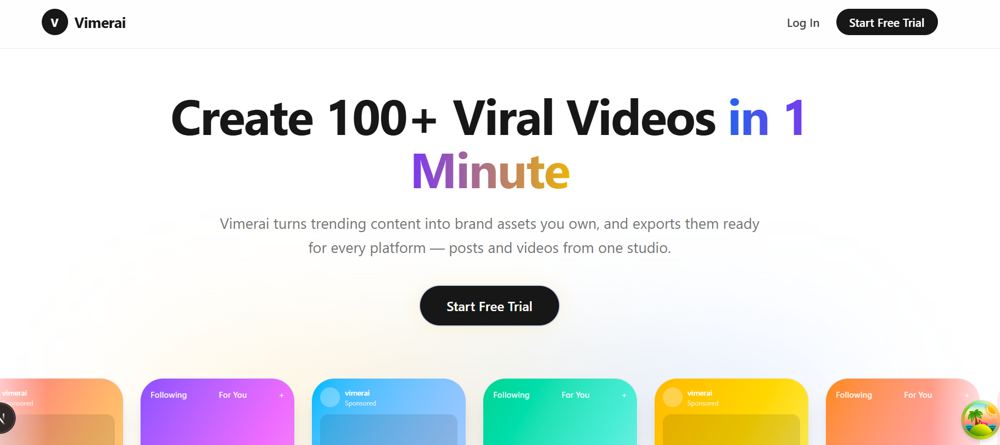
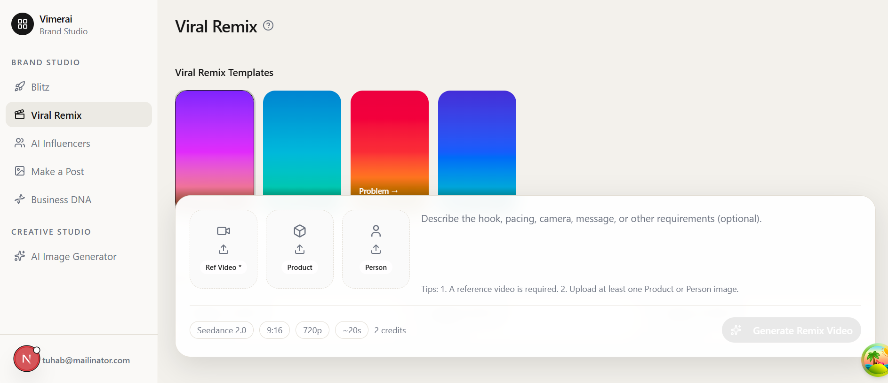

# Vimerai

AI creative studio for social content — turn trending formats and brand context into posts, videos, and images you own, ready for every platform.



## What it does

1. **Business DNA** — Paste a homepage URL to generate brand identity (colors, tone, audience, elevator pitch).
2. **Brand Studio** — Create content in focused modes:
   - **Blitz** — Review and accept AI-generated post concepts in a swipe-style queue.
   - **Viral Remix** — Remix a reference video with your product or person images and custom instructions.
   - **Make a Post** — Generate platform-ready social posts from brand + product context.
   - **AI Influencers** — Build reusable AI personas and generate portraits from them.
3. **Creative Studio** — **AI Image Generator** with reference uploads for standalone image jobs.
4. **Export** — Download finished assets for TikTok, Instagram, and other platforms.

Domain vocabulary and roadmap: [`CONTEXT.md`](CONTEXT.md). Decisions: [`docs/adr/`](docs/adr/).

## Brand Studio



Signed-in users land in **Brand Studio** (`/studio`) with separate create flows for posts and videos. Legacy multi-arm Generation (post + storyboard + video in one job) is parked; the primary path is Fetra-style jobs per format.

| Route | Feature |
|-------|---------|
| `/studio/blitz` | Blitz — post concept review queue |
| `/studio/videos` | Viral Remix — reference video + product/person remix |
| `/studio/posts` | Make a Post |
| `/studio/influencers` | AI Influencers |
| `/studio/images` | AI Image Generator |
| `/studio/business-dna` | Business DNA from URL |

## Project structure

```
vimerai/
├── frontend/          # Next.js App Router UI
├── backend/           # NestJS API (clean architecture)
├── assets/            # README and marketing screenshots
├── docs/
│   ├── adr/           # Architecture decision records
│   └── specs/         # Feature specs / PRDs
├── CONTEXT.md         # Product glossary and locked roadmap
└── README.md
```

## Quick start

### Prerequisites

- Node.js 18+
- PostgreSQL 14+
- pnpm (recommended)

### Backend

```bash
cd backend
pnpm install
cp .env.example .env
# Set DB_*, JWT_SECRET, FAL_KEY, OPENAI_API_KEY, and storage as needed
pnpm migration:run
pnpm start:dev
```

Default API: `http://localhost:3000` (see `PORT` in `backend/.env`).

### Frontend

```bash
cd frontend
pnpm install
cp .env.example .env.local
# NEXT_PUBLIC_API_URL should match the backend (default http://localhost:3000)
pnpm dev
```

App: `http://localhost:3000` when the frontend owns that port — if backend also uses `3000`, point one of them at a free port and update env accordingly.

## Documentation

| Doc | Purpose |
|-----|---------|
| [CONTEXT.md](CONTEXT.md) | Glossary, MVP roadmap |
| [docs/adr/](docs/adr/) | Locked technical decisions |
| [docs/specs/](docs/specs/) | Feature specs |
| [frontend/README.md](frontend/README.md) | Frontend setup |
| [backend/README.md](backend/README.md) | Backend setup |
| [API_DOCUMENTATION.md](API_DOCUMENTATION.md) | API reference (may lag; prefer code + CONTEXT) |

## Architecture (short)

**Frontend:** Next.js App Router, TanStack Query, React Hook Form + Zod.

**Backend:** NestJS clean architecture — application services behind ports (text/image/video providers), TypeORM + PostgreSQL, fal.ai for video and image generation, OpenAI for text.

**Core entities:** User, Brand, Product, Post Job, Video Job, Image Job, Generation (legacy multi-arm), Subscription / credits.

Jobs are driven by Brand + Product + Format. Prompt Studio and filesystem Product Kit are retired.

## Development

```bash
# Backend
cd backend && pnpm start:dev && pnpm test

# Frontend
cd frontend && pnpm dev
```

Run migrations after schema changes: `cd backend && pnpm migration:run`.

## Configuration (essentials)

### Frontend (`.env.local`)

```env
NEXT_PUBLIC_API_URL=http://localhost:3000
NEXT_PUBLIC_APP_URL=http://localhost:3000
```

### Backend (`.env`)

See [`backend/.env.example`](backend/.env.example). Minimums:

- Database: `DB_HOST`, `DB_PORT`, `DB_USERNAME`, `DB_PASSWORD`, `DB_NAME`
- Auth: `JWT_SECRET`
- Video / image: `FAL_KEY` (optional `FAL_BASE_URL` / `FAL_MODEL` / `FAL_IMAGE_MODEL`)
- Text: `OPENAI_API_KEY`
- Storage: `STORAGE_TYPE=local` or S3/R2 credentials when fal needs public Asset URLs
- Billing: PayPal or Stripe vars per `PAYMENT_PROVIDER`

## Deployment

- **Frontend:** Vercel (or similar); set `NEXT_PUBLIC_API_URL` / `NEXT_PUBLIC_APP_URL`.
- **Backend:** Railway, Render, Fly, or AWS; set env from `.env.example`, run migrations, then `pnpm build` and `pnpm start:prod`.

## License

Private / unlicensed unless otherwise stated.
