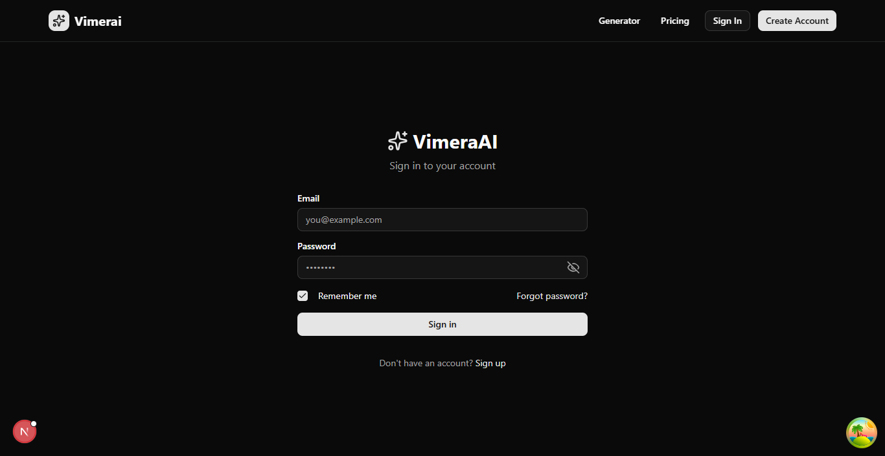
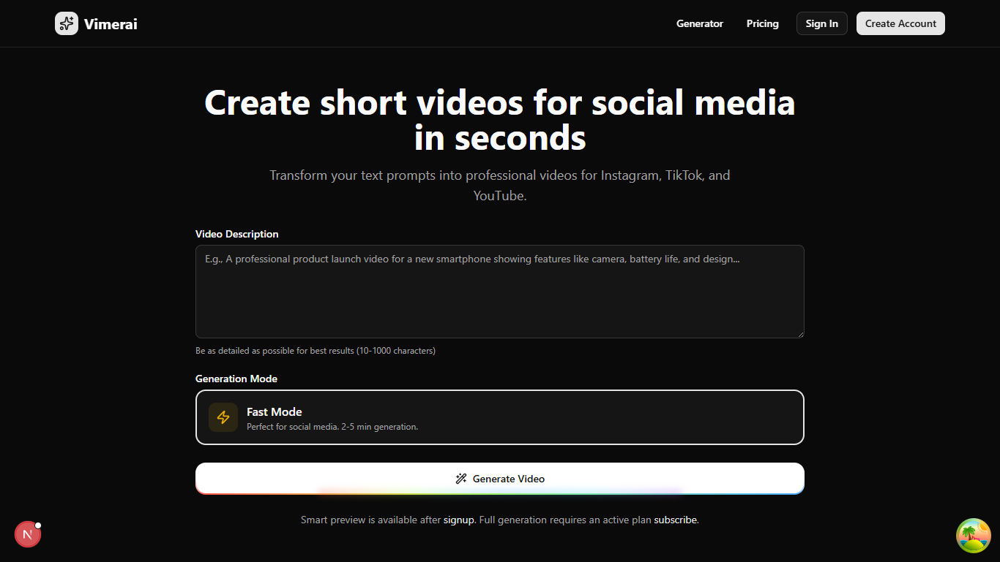
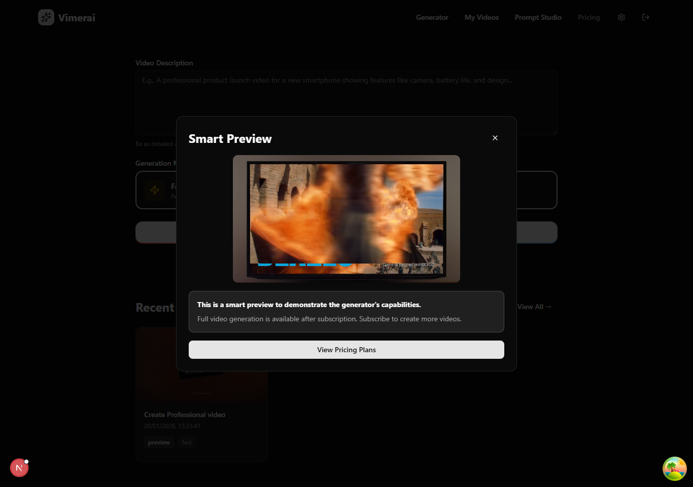
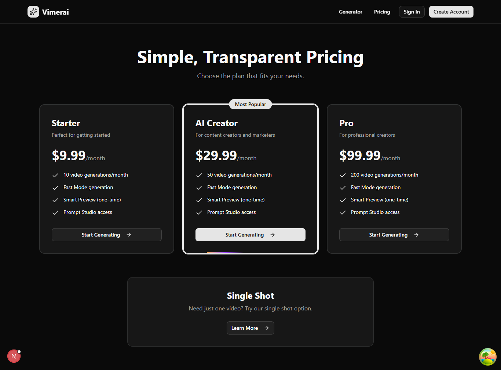
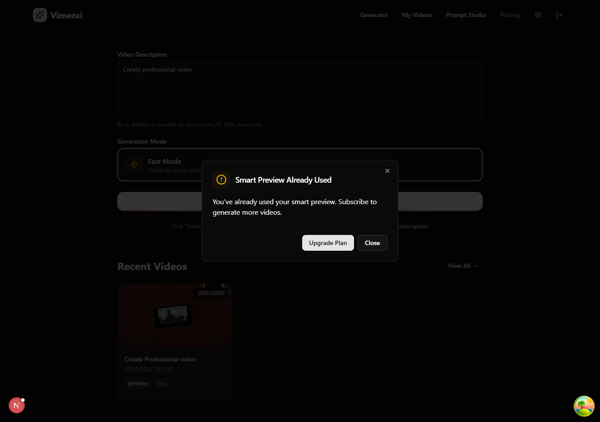
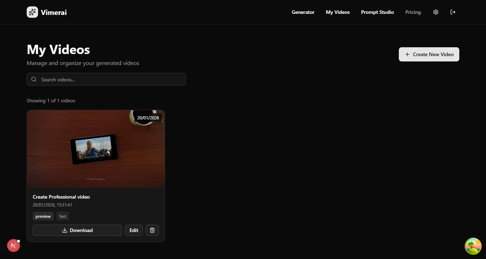

# Vimerai

<div align="center">
  <h1>AI-Powered Video Generation Platform</h1>
  <p>Transform text prompts into stunning videos with AI</p>
  
  
  
  
  
  
  
</div>

## 📋 Table of Contents

- [Overview](#overview)
- [Features](#features)
- [Tech Stack](#tech-stack)
- [Project Structure](#project-structure)
- [Quick Start](#quick-start)
- [Documentation](#documentation)
- [Architecture](#architecture)
- [Development](#development)
- [Deployment](#deployment)

## 🎯 Overview

Vimerai is a modern SaaS platform that enables users to generate professional videos from text descriptions using AI. The platform consists of a Next.js frontend and a NestJS backend, following clean architecture principles.

### Key Highlights

- ⚡ **Fast Generation**: Generate videos in 2-5 minutes
- 🎨 **Modern UI**: Beautiful, responsive design with dark mode
- 🔐 **Secure**: JWT authentication with password reset
- 📊 **Real-time**: Live status updates for video generation
- 🎬 **Management**: Complete video library with download
- 💳 **Subscriptions**: Plan-based video generation limits

## ✨ Features

### Core Features

- **Text-to-Video Generation**: Transform prompts into videos
- **Multiple Modes**: Fast (2-5 min), Cinematic (4K-8K), Avatar (coming soon)
- **Real-time Status**: Polling for generation progress
- **Video Library**: Manage all generated videos
- **Subscription Plans**: Starter, Creator, and Pro tiers
- **Preview Generation**: One-time free preview per account

### User Features

- User authentication (signup, login, password reset)
- Video generation with mode selection
- Video download and management
- Subscription management
- Usage tracking
- Profile settings

## 🛠 Tech Stack

### Frontend

- **Framework**: Next.js 16 (App Router)
- **Language**: TypeScript
- **Styling**: Tailwind CSS 4
- **UI**: Radix UI + shadcn/ui
- **State**: TanStack Query (React Query)
- **Forms**: React Hook Form + Zod
- **Animations**: Framer Motion

### Backend

- **Framework**: NestJS 11
- **Language**: TypeScript
- **Database**: PostgreSQL with TypeORM
- **Authentication**: JWT (Passport.js)
- **Validation**: class-validator
- **Payment**: Stripe integration
- **Video API**: Sora API integration

## 📁 Project Structure

```
vimerai/
├── frontend/              # Next.js frontend application
│   ├── src/
│   │   ├── app/          # Next.js App Router
│   │   ├── components/   # React components
│   │   └── lib/          # Utilities and hooks
│   ├── public/           # Static assets
│   │   └── platform/    # Platform screenshots
│   └── README.md         # Frontend documentation
│
├── backend/              # NestJS backend API
│   ├── src/
│   │   ├── application/ # Business logic
│   │   ├── domain/      # Domain entities
│   │   ├── infrastructure/ # External integrations
│   │   └── core/        # Core abstractions
│   └── README.md        # Backend documentation
│
├── API_DOCUMENTATION.md  # Complete API reference
└── README.md            # This file
```

## 🚀 Quick Start

### Prerequisites

- Node.js 18+
- PostgreSQL 14+
- pnpm (recommended) or npm

### Installation

1. **Clone the repository**
```bash
git clone https://github.com/yourusername/vimerai.git
cd vimerai
```

2. **Setup Backend**
```bash
cd backend
pnpm install
cp .env.example .env
# Edit .env with your configuration
pnpm migration:run
pnpm start:dev
```

3. **Setup Frontend**
```bash
cd frontend
pnpm install
cp .env.example .env.local
# Edit .env.local with your configuration
pnpm dev
```

4. **Access the application**
- Frontend: http://localhost:3000
- Backend API: http://localhost:3001

## 📚 Documentation

### Main Documentation

- **[Frontend README](frontend/README.md)** - Frontend setup and features
- **[Backend README](backend/README.md)** - Backend setup and architecture
- **[API Documentation](API_DOCUMENTATION.md)** - Complete API reference

### Code Documentation

- **[Frontend Code Docs](frontend/CODE_DOCUMENTATION.md)** - Frontend code structure
- **[Backend Code Docs](backend/CODE_DOCUMENTATION.md)** - Backend code structure

### Platform Screenshots

All screenshots are located in `frontend/public/platform/`:
- `landing-page.png` - Landing page
- `dashboard.png` - Main dashboard
- `generate.png` - Video generator
- `my-videos.png` - Video library

## 🏗 Architecture

### Frontend Architecture

- **App Router**: Next.js 16 App Router for routing
- **Component-Based**: Reusable React components
- **State Management**: TanStack Query for server state
- **API Client**: Centralized Axios instance
- **Form Handling**: React Hook Form with Zod validation

### Backend Architecture

- **Clean Architecture**: Three-layer architecture
  - Application Layer: Business logic
  - Domain Layer: Core entities
  - Infrastructure Layer: External integrations
- **Dependency Injection**: NestJS DI container
- **Repository Pattern**: Data access abstraction
- **Provider Pattern**: Video generation abstraction

### Database Schema

- **Users**: User accounts and authentication
- **Videos**: Generated video metadata
- **Subscriptions**: User plans and limits
- **Prompt Templates**: Saved prompt templates

## 💻 Development

### Development Workflow

1. **Backend**: Run `pnpm start:dev` in `backend/`
2. **Frontend**: Run `pnpm dev` in `frontend/`
3. **Database**: Ensure PostgreSQL is running
4. **Migrations**: Run migrations when schema changes

### Code Style

- **TypeScript**: Strict mode enabled
- **ESLint**: Configured for both projects
- **Prettier**: Code formatting
- **Git Hooks**: Pre-commit hooks (optional)

### Testing

```bash
# Backend tests
cd backend
pnpm test
pnpm test:e2e

# Frontend tests (when implemented)
cd frontend
pnpm test
```

## 🚢 Deployment

### Frontend Deployment

**Recommended**: Vercel
```bash
cd frontend
vercel deploy
```

**Environment Variables**:
- `NEXT_PUBLIC_API_URL`: Backend API URL
- `NEXT_PUBLIC_APP_URL`: Frontend URL

### Backend Deployment

**Recommended**: Railway, Heroku, or AWS

**Environment Variables**:
- Database connection
- JWT secret
- Sora API key
- Stripe keys (optional)

**Steps**:
1. Set environment variables
2. Run database migrations
3. Build: `pnpm build`
4. Start: `pnpm start:prod`

## 📊 Features by Phase

### Phase 1 (Current) ✅

- [x] User authentication
- [x] Video generation (Fast mode)
- [x] Video library
- [x] Subscription management
- [x] Real-time status polling
- [x] Video download

### Phase 2 (Planned)

- [ ] Payment integration
- [ ] Cinematic mode
- [ ] Advanced video editor
- [ ] Prompt templates
- [ ] Video analytics

### Phase 3 (Future)

- [ ] Avatar mode
- [ ] Collaboration features
- [ ] API access
- [ ] Mobile apps
- [ ] Advanced analytics

## 🔧 Configuration

### Frontend Environment Variables

```env
NEXT_PUBLIC_API_URL=http://localhost:3001
NEXT_PUBLIC_APP_URL=http://localhost:3000
```

### Backend Environment Variables

```env
# Database
DB_HOST=localhost
DB_PORT=5432
DB_USERNAME=postgres
DB_PASSWORD=password
DB_DATABASE=vimerai

# JWT
JWT_SECRET=your_secret_key
JWT_EXPIRES_IN=7d

# Server
PORT=3001
NODE_ENV=development

# Video Generation
VIDEO_GENERATION_SORA_API_KEY=your_key
VIDEO_GENERATION_SORA_API_URL=https://api.sora.com/v1/videos

# Stripe (optional)
STRIPE_SECRET_KEY=your_key
```

## 🤝 Contributing

1. Fork the repository
2. Create a feature branch (`git checkout -b feature/amazing-feature`)
3. Commit changes (`git commit -m 'Add amazing feature'`)
4. Push to branch (`git push origin feature/amazing-feature`)
5. Open a Pull Request

## 📝 License

[Your License Here]

## 🙏 Acknowledgments

- [Next.js](https://nextjs.org/) - React framework
- [NestJS](https://nestjs.com/) - Node.js framework
- [shadcn/ui](https://ui.shadcn.com/) - UI components
- [Sora](https://openai.com/sora) - Video generation API

## 📞 Support

- **Documentation**: See individual README files
- **Issues**: GitHub Issues
- **Email**: support@vimerai.com

---

<div align="center">
  <p>Built with ❤️ using Next.js and NestJS</p>
  <p>© 2024 Vimerai. All rights reserved.</p>
</div>

