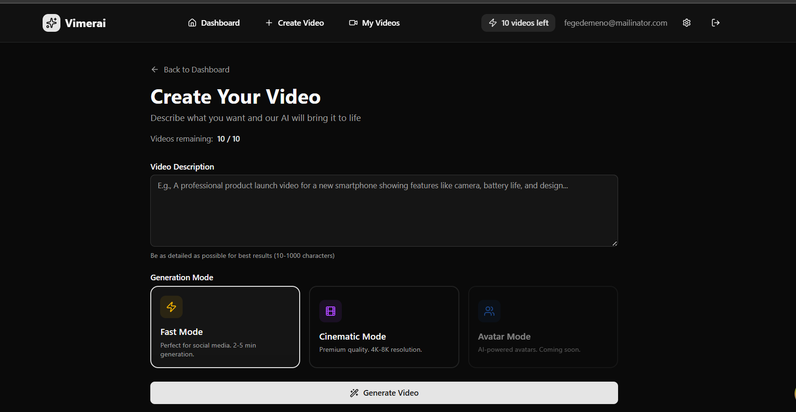
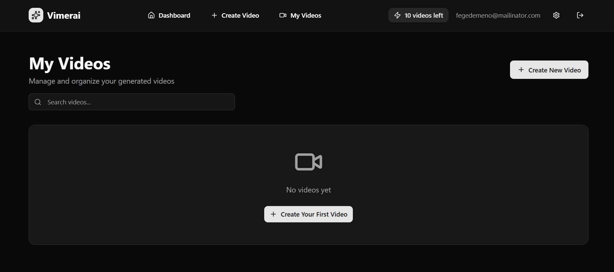
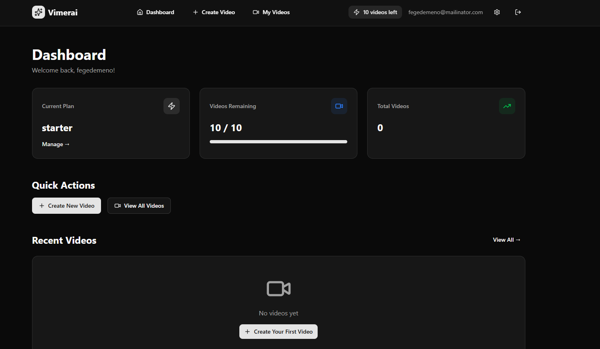

# Vimerai Frontend

<div align="center">
  <h3>AI-Powered Video Generation Platform</h3>
  <p>Transform text prompts into stunning videos with AI</p>
</div>


## 📋 Table of Contents

- [Overview](#overview)
- [Tech Stack](#tech-stack)
- [Project Structure](#project-structure)
- [Getting Started](#getting-started)
- [Key Features](#key-features)
- [Pages & Routes](#pages--routes)
- [Architecture](#architecture)
- [API Integration](#api-integration)
- [Development](#development)
- [Deployment](#deployment)

## 🎯 Overview

Vimerai is a modern SaaS platform that enables users to generate professional videos from text descriptions using AI. The frontend is built with Next.js 16, featuring a clean, intuitive interface optimized for fast video generation workflows.

### Key Highlights

- ⚡ **Fast Generation**: Generate videos in 2-5 minutes
- 🎨 **Modern UI**: Beautiful, responsive design with dark mode support
- 🔐 **Secure Auth**: JWT-based authentication with password reset
- 📊 **Real-time Updates**: Live status polling for video generation
- 🎬 **Video Management**: Complete video library with download capabilities

## 🛠 Tech Stack

### Core Technologies

- **Framework**: [Next.js 16.1.1](https://nextjs.org/) (App Router)
- **Language**: TypeScript 5
- **Styling**: Tailwind CSS 4
- **UI Components**: Radix UI primitives
- **Animations**: Framer Motion
- **Forms**: React Hook Form + Zod validation
- **State Management**: TanStack Query (React Query)
- **HTTP Client**: Axios

### Key Libraries

```json
{
  "@tanstack/react-query": "^5.62.11",
  "react-hook-form": "^7.69.0",
  "zod": "^4.3.4",
  "framer-motion": "^12.23.26",
  "next-themes": "^0.4.6"
}
```

## 📁 Project Structure

```
frontend/
├── public/
│   ├── platform/          # Platform screenshots
│   └── assets/            # Static assets
├── src/
│   ├── app/               # Next.js App Router
│   │   ├── (auth)/        # Authentication routes
│   │   │   ├── login/
│   │   │   ├── signup/
│   │   │   └── password-reset/
│   │   ├── dashboard/     # Protected dashboard routes
│   │   │   ├── generator/ # Video generation
│   │   │   ├── my-videos/ # Video library
│   │   │   ├── editor/    # Video editor
│   │   │   └── settings/  # User settings
│   │   ├── layout.tsx     # Root layout
│   │   └── page.tsx       # Landing page
│   ├── components/        # Reusable components
│   │   └── ui/           # UI primitives (shadcn/ui)
│   ├── lib/
│   │   ├── api/          # API client functions
│   │   ├── hooks/        # Custom React hooks
│   │   ├── auth/         # Auth utilities & schemas
│   │   └── providers/    # Context providers
│   └── types/            # TypeScript types
└── package.json
```

## 🚀 Getting Started

### Prerequisites

- Node.js 18+ 
- pnpm (recommended) or npm
- Backend API running (see [Backend README](../backend/README.md))

### Installation

```bash
# Navigate to frontend directory
cd frontend

# Install dependencies
pnpm install

# Copy environment template
cp .env.example .env.local

# Edit .env.local with your configuration
# NEXT_PUBLIC_API_URL=http://localhost:3001
```

### Environment Variables

Create `.env.local`:

```env
# API Configuration
NEXT_PUBLIC_API_URL=http://localhost:3001

# App Configuration
NEXT_PUBLIC_APP_URL=http://localhost:3000
```

### Development

```bash
# Start development server
pnpm dev

# Build for production
pnpm build

# Start production server
pnpm start

# Run linter
pnpm lint
```

Visit `http://localhost:3000` to see the application.

## ✨ Key Features

### 1. Landing Page


The landing page showcases:
- Hero section with video background
- Feature highlights
- Video showcase with YouTube embeds
- Generation modes (Fast, Cinematic, Avatar)
- Pricing plans
- FAQ section
- Call-to-action with video background

### 2. Video Generator



**Location**: `/dashboard/generator`

**Features**:
- Multi-line prompt input with character counter
- Generation mode selection (Fast/Cinematic/Avatar)
- Real-time status polling
- Subscription limit checking
- Automatic video download on completion
- Loading states and error handling

**Key Components**:
- `Form` with React Hook Form validation
- Status polling with TanStack Query
- Subscription limit display
- Mode selection cards

### 3. My Videos



**Location**: `/dashboard/my-videos`

**Features**:
- Video list with thumbnails
- Status indicators (pending, processing, completed, failed)
- Download functionality
- Delete with confirmation
- Empty state handling
- Pagination support

### 4. Dashboard



**Location**: `/dashboard`

**Features**:
- Quick stats (plan, videos remaining, total videos)
- Recent videos preview
- Quick actions
- Navigation to key features

## 📄 Pages & Routes

### Public Routes

| Route | Description | Component |
|-------|-------------|-----------|
| `/` | Landing page | `app/page.tsx` |
| `/login` | User login | `app/(auth)/login/page.tsx` |
| `/signup` | User registration | `app/(auth)/signup/page.tsx` |
| `/password-reset` | Password reset | `app/(auth)/password-reset/page.tsx` |

### Protected Routes (Dashboard)

| Route | Description | Component |
|-------|-------------|-----------|
| `/dashboard` | Main dashboard | `app/dashboard/page.tsx` |
| `/dashboard/generator` | Video generator | `app/dashboard/generator/page.tsx` |
| `/dashboard/my-videos` | Video library | `app/dashboard/my-videos/page.tsx` |
| `/dashboard/editor/[id]` | Video editor | `app/dashboard/editor/[id]/page.tsx` |
| `/dashboard/settings` | User settings | `app/dashboard/settings/page.tsx` |

## 🏗 Architecture

### API Client

Centralized API client in `lib/api/`:

```typescript
// lib/api/client.ts
import axios from 'axios';

export const api = axios.create({
  baseURL: process.env.NEXT_PUBLIC_API_URL,
  headers: {
    'Content-Type': 'application/json',
  },
});

// Automatic token injection
api.interceptors.request.use((config) => {
  const token = localStorage.getItem('token');
  if (token) {
    config.headers.Authorization = `Bearer ${token}`;
  }
  return config;
});
```

### Custom Hooks

React Query hooks in `lib/hooks/`:

```typescript
// lib/hooks/use-generator.ts
export const useGenerateVideo = () => {
  return useMutation({
    mutationFn: generatorApi.generateVideo,
    onSuccess: () => {
      queryClient.invalidateQueries({ queryKey: ['videos'] });
    },
  });
};

export const useGenerationStatus = (jobId: string | null, enabled: boolean) => {
  return useQuery({
    queryKey: ['generation-status', jobId],
    queryFn: () => generatorApi.getGenerationStatus(jobId!),
    enabled: enabled && !!jobId,
    refetchInterval: 2000, // Poll every 2 seconds
  });
};
```

### Form Validation

Zod schemas in `lib/auth/schema.ts`:

```typescript
export const generateVideoSchema = z.object({
  prompt: z.string()
    .min(10, 'Prompt must be at least 10 characters')
    .max(1000, 'Prompt must be less than 1000 characters'),
  mode: z.enum(['fast', 'cinematic', 'avatar']).default('fast'),
});
```

## 🔌 API Integration

### Available API Clients

- **Auth API** (`lib/api/auth.api.ts`): Login, signup, password reset
- **Generator API** (`lib/api/generator.api.ts`): Video generation, status, download
- **Videos API** (`lib/api/videos.api.ts`): Video CRUD operations
- **Subscription API** (`lib/api/subscription.api.ts`): Plans, usage, checkout
- **Users API** (`lib/api/users.api.ts`): User profile management

### Example Usage

```typescript
import { useGenerateVideo } from '@/lib/hooks/use-generator';

function GeneratorPage() {
  const generateVideo = useGenerateVideo();

  const handleSubmit = async (data: GenerateVideoInput) => {
    generateVideo.mutate(
      { prompt: data.prompt, mode: data.mode },
      {
        onSuccess: (response) => {
          // Handle success
          setJobId(response.jobId);
        },
        onError: (error) => {
          // Handle error
          console.error(error);
        },
      }
    );
  };
}
```

## 💻 Development

### Code Style

- **ESLint**: Configured with Next.js rules
- **Prettier**: Code formatting (via ESLint)
- **TypeScript**: Strict mode enabled

### Component Guidelines

1. **Use TypeScript** for all components
2. **Client Components**: Mark with `"use client"` directive
3. **Server Components**: Default (no directive needed)
4. **UI Components**: Use shadcn/ui primitives from `components/ui/`
5. **Forms**: Use React Hook Form with Zod validation

### Adding New Features

1. **Create API client** in `lib/api/`
2. **Create custom hook** in `lib/hooks/`
3. **Add route** in `app/` directory
4. **Use UI components** from `components/ui/`
5. **Add types** in `types/index.ts` if needed

### Testing

```bash
# Run linter
pnpm lint

# Type check
pnpm type-check
```

## 🚢 Deployment

### Build for Production

```bash
# Build the application
pnpm build

# Start production server
pnpm start
```

### Recommended Platforms

- **Vercel** (Recommended): Optimized for Next.js
  ```bash
  vercel deploy
  ```

- **Netlify**: 
  ```bash
  netlify deploy --prod
  ```

- **AWS Amplify**: Connect GitHub repository

### Environment Variables

Set these in your deployment platform:

- `NEXT_PUBLIC_API_URL`: Backend API URL
- `NEXT_PUBLIC_APP_URL`: Frontend URL (for redirects)

## 📊 Performance Targets

- **Lighthouse Performance**: > 80
- **First Contentful Paint**: < 1.5s
- **Time to Interactive**: < 3.5s
- **Cumulative Layout Shift**: < 0.1

## 🎨 UI Components

### Available Components

Located in `components/ui/`:

- `Button` - Primary action buttons
- `Input` - Text inputs
- `Textarea` - Multi-line inputs
- `Form` - Form wrapper with validation
- `Tabs` - Tab navigation
- `Accordion` - Collapsible content
- `Marquee` - Scrolling text
- `NumberTicker` - Animated numbers
- `WordRotate` - Rotating text
- `BorderBeam` - Animated borders

### Usage Example

```typescript
import { Button } from '@/components/ui/button';
import { Input } from '@/components/ui/input';

function MyComponent() {
  return (
    <div>
      <Input placeholder="Enter text..." />
      <Button>Click me</Button>
    </div>
  );
}
```

## 🔐 Authentication Flow

1. **Login/Signup**: User authenticates via API
2. **Token Storage**: JWT stored in `localStorage`
3. **Protected Routes**: Checked via middleware/guards
4. **Auto-redirect**: Unauthenticated users redirected to login
5. **Token Refresh**: Handled automatically via interceptors

## 📝 Code Documentation

### Key Files

- **`lib/api/client.ts`**: Axios instance with interceptors
- **`lib/hooks/use-auth.ts`**: Authentication hooks
- **`lib/hooks/use-generator.ts`**: Video generation hooks
- **`lib/providers/query-provider.tsx`**: React Query provider
- **`app/dashboard/layout.tsx`**: Dashboard layout with navigation

### Custom Hooks

| Hook | Purpose | Location |
|------|---------|----------|
| `useUser` | Get current user | `lib/hooks/use-user.ts` |
| `useAuth` | Auth mutations | `lib/hooks/use-auth.ts` |
| `useGenerateVideo` | Generate video | `lib/hooks/use-generator.ts` |
| `useGenerationStatus` | Poll generation status | `lib/hooks/use-generator.ts` |
| `useVideos` | Get video list | `lib/hooks/use-videos.ts` |
| `useCurrentSubscription` | Get subscription | `lib/hooks/use-subscription.ts` |

## 🐛 Troubleshooting

### Common Issues

**Issue**: API calls failing
- Check `NEXT_PUBLIC_API_URL` in `.env.local`
- Verify backend is running
- Check browser console for CORS errors

**Issue**: Authentication not working
- Verify token is stored in `localStorage`
- Check token expiration
- Clear localStorage and re-login

**Issue**: Build errors
- Run `pnpm install` to ensure dependencies are installed
- Check TypeScript errors: `pnpm type-check`
- Clear `.next` folder and rebuild

## 📚 Additional Resources

- [Next.js Documentation](https://nextjs.org/docs)
- [TanStack Query](https://tanstack.com/query/latest)
- [React Hook Form](https://react-hook-form.com/)
- [Tailwind CSS](https://tailwindcss.com/)
- [shadcn/ui](https://ui.shadcn.com/)

## 🤝 Contributing

1. Fork the repository
2. Create a feature branch (`git checkout -b feature/amazing-feature`)
3. Commit changes (`git commit -m 'Add amazing feature'`)
4. Push to branch (`git push origin feature/amazing-feature`)
5. Open a Pull Request

## 📄 License

[Your License Here]

---

Built with ❤️ using Next.js and TypeScript
